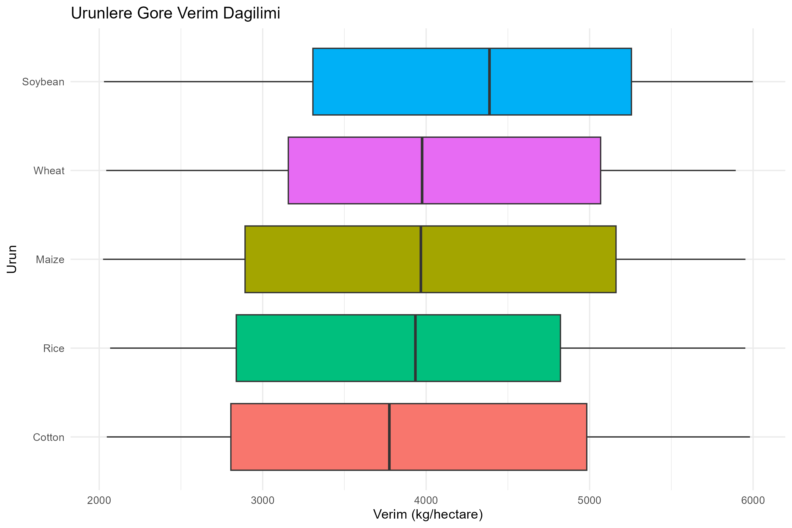
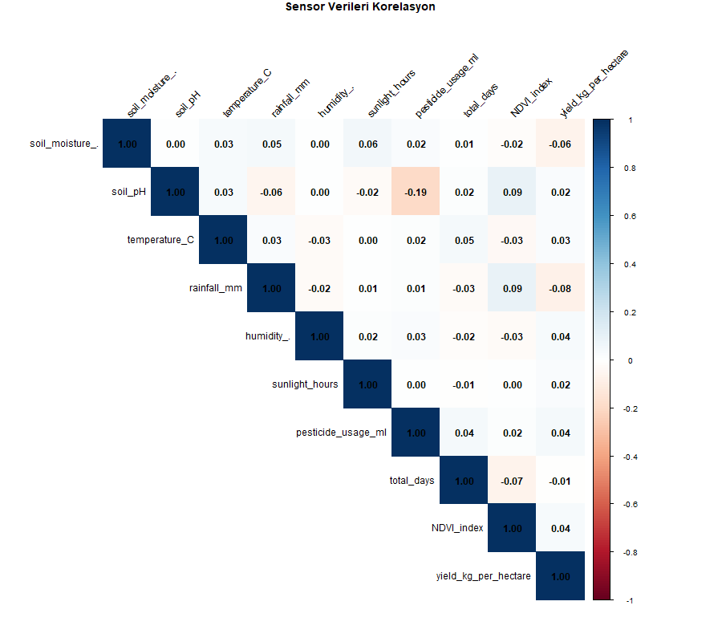
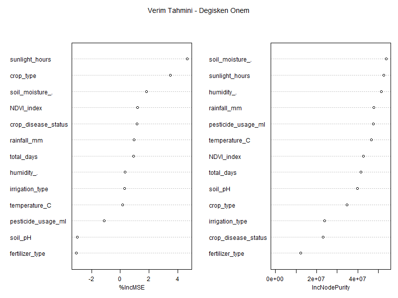

# 🌱 Smart Farming IoT Analysis

Ecuador tarim verisi uzerinde yapay zeka destekli
akilli ciftlik analizi. IoT sensorler, uydu verisi
(NDVI) ve makine ogrenmesi kullanilarak mahsul
verimi analiz edilmistir.

## 🎯 Proje Amaci

- IoT sensor verileri (toprak nemi, sicaklik, nem)
  ile mahsul verimi arasindaki iliskiyi analiz etmek
- Uydu verisi (NDVI) ile bitki sagligi takibi
- Random Forest ile verim tahmini yapmak
- Sensor verilerinin tarimsal kararlara etkisini olcmek

## 📡 Veri Seti

500 ciftlik kaydi, 22 degisken:

| Sensor | Olcum |
|--------|-------|
| Toprak nemi | % |
| Toprak pH | 0-14 |
| Sicaklik | Celsius |
| Yagis | mm |
| Nem | % |
| Gunes saati | saat/gun |
| NDVI indeksi | 0-1 (uydu) |

## 📊 Analizler

- **EDA** — Urun bazinda verim dagilimi
- **Sensor Analizi** — Toprak nemi ve NDVI vs verim
- **Hastalik Etkisi** — Hastalik durumuna gore verim
- **Korelasyon** — Sensor verileri arasi iliskiler
- **Random Forest** — Verim tahmin modeli

## 🔍 Kritik Bulgular

- Sunlight_hours ve soil_moisture en onemli degiskenler
- Sentetik veri oldugu icin R2 = 0.007 (gercek veride
  anlamli sonuclar beklenir)
- Korelasyon analizi verinin sentetik olduğunu kanitliyor
- Gercek IoT sensor verisiyle NDVI-verim iliskisi
  guclu pozitif korelasyon gosterecektir

## 📈 Ornek Gorseller

### Urunlere Gore Verim Dagilimi

### Sensor Korelasyon Matrisi

### Degisken Onem Grafigi

## 🛠️ Kullanilan Araclar

- R 4.5 + RStudio
- tidyverse, ggplot2
- corrplot
- randomForest + caret

## 🔗 Veri Kaynagi

[Smart Farming Sensor Data - Kaggle](https://www.kaggle.com/datasets/atharvasoundankar/smart-farming-sensor-data-for-yield-prediction)
